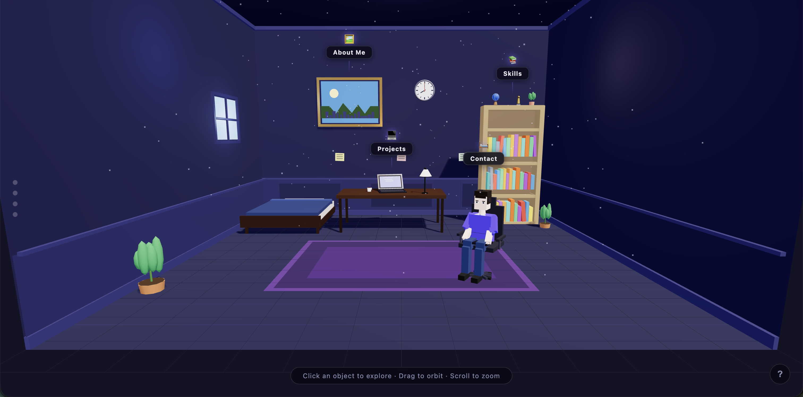
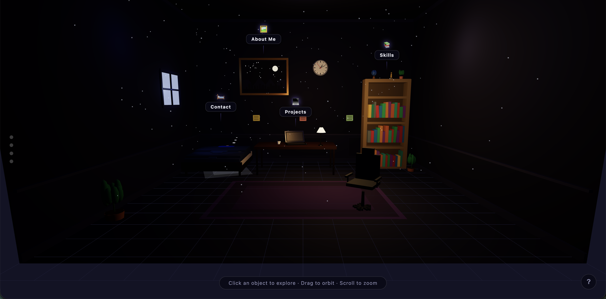

# 🖥️ My 3D Resume

An interactive 3D portfolio experience built with Three.js and React — explore a fully rendered room and discover my work, skills, and contact info by clicking on objects.

> **Live Demo:** [_My 3D Resume_](https://my-3d-resume-one.vercel.app/)

---

## Preview




---

## What It Is

Instead of a flat page, this portfolio renders a 3D room you can orbit, zoom, and interact with. Each object in the room is a portal to a section of my resume:

| Object | Section |
|---|---|
| 💻 Laptop | Projects |
| 📚 Bookshelf | Skills |
| 🖼️ Wall Frame | About Me |
| 🧑‍💻 Character | Contact |

The room lighting and wall painting also change based on the time of day — visit at night for a different look.

---

## Controls

| Action | Result |
|---|---|
| Click & drag | Orbit the camera |
| Scroll | Zoom in / out |
| Click an object | Fly to it and open detail panel |
| `ESC` | Close panel and reset view |
| Side dots | Jump to a specific object |

---

## Tech Stack

- **[React 18](https://react.dev/)** — UI components with Hooks
- **[React Router 6](https://reactrouter.com/)** — Client-side routing
- **[Three.js](https://threejs.org/)** — 3D scene, geometry, materials, lighting, raycasting
- **[GSAP](https://gsap.com/)** — Smooth camera fly-to animations
- **[Zustand](https://github.com/pmndrs/zustand)** — Lightweight state management
- **[Vite](https://vitejs.dev/)** — Build tool and dev server
- **TypeScript** — End-to-end type safety

---

## Project Structure

```
my-3d-resume/
├── src/
│   ├── components/
│   │   ├── Layout/                # Root layout with SEO meta
│   │   ├── Scene/                 # Three.js canvas and 3D logic
│   │   │   ├── Scene.tsx
│   │   │   └── Scene.module.css
│   │   └── UI/                    # Panel, NavDots, LoadingScreen, HelpModal, etc.
│   ├── pages/                     # Route pages (Home, About, Projects, Contact)
│   ├── stores/                    # Zustand stores
│   │   ├── sceneStore.ts          # Scene state (loading, focus, lamp, clock)
│   │   └── uiStore.ts             # Panel content, help modal, mobile notice
│   ├── scene/                     # Pure TS modules wrapping Three.js logic
│   │   ├── setup.ts               # Renderer, camera, controls
│   │   ├── lighting.ts            # Day/night lighting system
│   │   ├── clock.ts               # Simulated time of day
│   │   ├── interactions.ts        # Raycasting & click handling
│   │   ├── camera-anim.ts         # Fly-to camera animations
│   │   └── labels.ts              # Object labels
│   ├── data/
│   │   └── resume.ts              # All portfolio content (single source of truth)
│   ├── styles/
│   │   └── global.css             # Global styles and CSS variables
│   ├── App.tsx                    # Router configuration
│   └── main.tsx                   # Application entry point
├── index.html
├── vite.config.ts
├── tsconfig.json
└── package.json
```

---

## Customization

All personal content lives in **`src/data/resume.ts`**. Edit it to make this your own:

```ts
export const resume = {
  about: {
    name: "Your Name",
    role: "Your Title",
    bio: "Your bio...",
    // ...
  },
  projects: [ /* your projects */ ],
  skills: { frontend: [], backend: [], tools: [] },
  contact: { email: "", github: "", linkedin: "" },
};
```

---

## Running Locally

```bash
npm install
npm run dev
```

Then open `http://localhost:5173`.

---

## Building for Production

```bash
npm run build
npm run preview   # preview the production build locally
```

---

## Deploying

- **Vercel** — push to GitHub and connect the repo; zero-config for Vite + React
- **Netlify** — same, connect repo and deploy
- **GitHub Pages** — build with `npm run build` and deploy the `dist/` folder

---

## Performance Notes

- Three.js is lazy-loaded — zero initial bundle impact
- Code-split into separate chunks: `three.js` (550KB), `gsap.js` (70KB)
- Shadows are disabled on mobile to maintain smooth frame rates
- Pixel ratio is capped on high-DPI displays
- All 3D geometry is generated in JavaScript — no external model files needed
- Static fallback pages (`/about`, `/projects`, `/contact`) for SEO and no-WebGL scenarios

---

## License

MIT — feel free to fork, customize, and use as your own portfolio.
